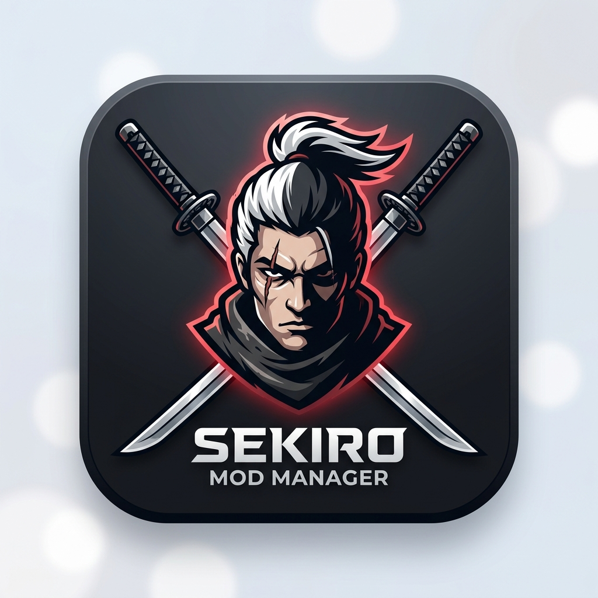

# SekiroModManager（只狼 MOD 管理器）

<div align="center">



**专为《只狼：影逝二度》量身打造的现代 MOD 管理工具**  
*零提权硬链接挂载引擎 · 原生沉浸式白天/黑夜双模式 · 智能压缩包归一化导入 · 清单驱动安全回滚*

[](https://dotnet.microsoft.com/)
[]()
[]()
[]()

</div>

> **接手开发 / 维护请先阅读 [DEVELOPMENT.md](DEVELOPMENT.md)**（架构、设计决策、测试铁律、路线图）与 **[AGENTS.md](AGENTS.md)**（AI 编码工具工作区指引）。

---

## ✨ 核心特性

- **⚡ 免管理员权限极速挂载**：
  - 首选 Windows **硬链接（HardLink）** 将 MOD 文件映射至游戏 `mods/` 目录，毫秒级生效，不占双倍硬盘空间，且完全无需 UAC 管理员提权。
  - 跨盘自动平滑降级（符号链接 SymbolicLink $\to$ 物理复制 Copy），兼容所有磁盘分区场景。
- **🎨 沉浸式白天 / 黑夜双主题**：
  - 针对 Windows 10/11 深度定制，通过 DWM (Desktop Window Manager) API 自动沉浸式同步标题栏与边框底色，彻底消除系统强调色（如突兀的纯蓝）导致的视觉割裂。
  - 支持一键平滑无闪烁切换暗黑水墨风与明亮素雅风。
- **📦 智能归一化拖拽导入**：
  - 支持直接将 `.zip` / `.7z` / `.rar` 压缩包或文件夹拖入管理器窗口。
  - 广度优先自动探测只狼游戏数据特征目录（`chr/`, `parts/`, `event/`, `map/` 等）与 `.dcx`/`.param` 文件，自动剥离玩家任意多层的无规则嵌套打包。
  - 智能兼容 GBK/CP936 中文文件名，杜绝 Windows 资源管理器打包乱码。
- **🛡️ 清单驱动的安全清理机制**：
  - 每次部署在 `mods/.modmanager/manifest.json` 自动记录全部托管条目。
  - 清理或重新部署时**严格仅删除清单内条目**，玩家手动拷贝进 `mods/` 目录的其他自制文件 100% 不会被误删。
- **🔍 冲突预警与部署计划**：
  - 可视化预览所有待生效文件与冲突覆盖关系；同一文件被多个启用 MOD 覆盖时，**数值高者胜出**，冲突明细一目了然。
- **🎮 自动化环境配置与启动**：
  - 自动定位 Steam 安装目录与只狼游戏本体。
  - 自动检测并维护 `modengine.ini`，安全修改并自动备份 `.bak`。
  - 支持在管理器内一键无缝唤起游戏。

---

## 🏛️ 目录结构（2+1 黄金三角架构）

项目采用职责清晰的“黄金三角”架构，核心算法与表现层完全解耦，为后续引入参数合并（SoulsFormats）预留了极佳的扩展性：

```text
SekiroModManager/
├── 启动管理器.bat                     # 一键便捷启动脚本（秒级拉起，自动关闭终端）
├── SekiroModManager.sln               # 精简解决方案
├── README.md                          # 项目技术文档
├── src/
│   ├── SekiroModManager.Core/         # 【核心引擎库】零 UI 依赖纯逻辑
│   │   ├── ModManager.cs              # 核心门面类（Facade）
│   │   ├── ConfigStore.cs             # 配置持久化（config.json）
│   │   ├── Models/                    # 数据模型（ModItem / AppConfig / DeployPlan 等）
│   │   └── Services/
│   │       ├── GameLocator.cs         # 注册表与 Steam libraryfolders 路径探测
│   │       ├── ModEngineService.cs    # Mod Engine 状态检测与 INI 安全维护
│   │       ├── ModArchiveService.cs   # 压缩包解压与目录归一化定位
│   │       └── DeployEngine.cs        # 冲突分析、硬链接挂载与清单回滚
│   └── SekiroModManager.App/          # 【桌面客户端】现代 WPF MVVM 表现层
│       ├── Common/                    # 基础组件（RelayCommand, ObservableObject, Converters）
│       ├── Theme/                     # 日夜模式资源字典与 DWM 原生标题栏适配器
│       ├── ViewModels/                # MainViewModel 与 ModItemViewModel
│       └── Views/                     # MainWindow 与 PlanWindow（部署计划窗）
└── tests/
    └── SekiroModManager.Tests/        # 【统一测试套件】覆盖引擎与界面的 34 个自动化测试
```

---

## 🚀 快速上手

### 环境需求
- **Windows 10 / 11** (x64)
- **[.NET 8.0 Runtime 或 SDK](https://dotnet.microsoft.com/download/dotnet/8.0)**

### 方式一：一键启动（推荐）
直接双击项目根目录下的 **`启动管理器.bat`** 即可直接秒级唤起图形界面。

### 方式二：通过 .NET CLI 运行
```bash
# 启动桌面端
dotnet run --project src/SekiroModManager.App

# 执行全部自动化单元测试（34 个用例全绿）
dotnet test SekiroModManager.sln

# 编译 Release 发布版本
dotnet publish src/SekiroModManager.App -c Release -r win-x64 --self-contained false
```

---

## ⚙️ 核心挂载策略说明

| 优先级 | 挂载方式 | 触发条件 | 特性说明 |
|:---:|:---|:---|:---|
| **1** | **硬链接 (HardLink)** | MOD 仓库与游戏同盘卷 | **默认推荐**。免管理员提权，读取性能等同原生文件，删除链接绝不损坏源文件 |
| **2** | **符号链接 (SymbolicLink)** | MOD 仓库与游戏跨磁盘分区 | 不占额外硬盘空间（需要 Windows 开发者模式或管理员权限） |
| **3** | **物理复制 (Copy)** | 前两者环境受限时兜底 | 自动降级保障 Mod 绝对可用，占用目标磁盘空间 |

---

## 🗺️ 后续迭代路线

- [ ] **SoulsFormats 参数合并**：接入 SoulsFormats 库，实现多 MOD 同时修改 `gameparam.parambnd.dcx`（如血量、武器属性）时的字段级智能冲突合并。
- [ ] **多配置方案预设（Profiles）**：支持一键切换“全动作包方案”、“纯外观换装方案”、“难度增强方案”。
- [ ] **NexusMods 元数据同步**：展示 MOD 封面预览图、版本号、作者及更新检查。
- [ ] **多语言国际化 (i18n)**：增加简/繁中文与英文双语支持。

---

## 📄 开源许可证

本项目基于 [MIT License](LICENSE) 开源发布。
